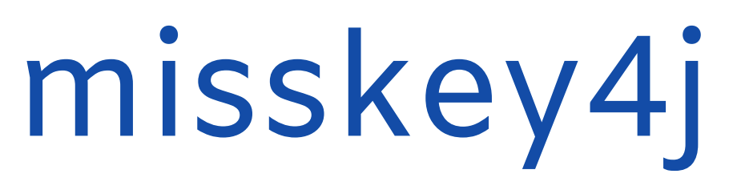

Misskey4J is client library to call api to [Misskey](https://join.misskey.page/ja/) written in java. This will be able to compile with [google/j2objc] to Objective-C library. (iOS, Mac OS) 

## How To Use

First, you must register your application to Misskey instance server (like as [misskey.io](https://misskey.io/)).

```java
Misskey misskey = MisskeyFactory.getInstance(HOST);

Response<CreateAppResponse> response =
    misskey.app().createApp(
        CreateAppRequest.builder()
            .name("Misskey4J")
            .description("Misskey4J Test")
            .callbackUrl("http://localhost:8080/")
            .permission(Scope.ALL)
            .build());

System.out.println("Secret:" + response.get().getSecret());
```

next, generate user authentication url from client secret.

```java
Misskey misskey = MisskeyFactory.getInstance(HOST);

Response<GenerateAuthSessionResponse> response =
    misskey.auth().generateAuthSession(
        GenerateAuthSessionRequest.builder()
            .appSecret(CLIENT_SECRET)
            .build());

System.out.println("URL: " + response.get().getUrl());
```

and user access to url, and get verify token which include redirected url as param. finally get user access token as followings.

```java
Misskey misskey = MisskeyFactory.getInstance(HOST);

Response<UserKeyAuthSessionResponse> response =
    misskey.auth().userKeyAuthSession(
        UserKeyAuthSessionRequest.builder()
            .token("VERIFY TOKEN")
            .appSecret(CLIENT_SECRET)
            .build());

System.out.println("USER TOKEN: " + response.get().getAccessToken());
System.out.println("NAME: " + response.get().getUser().getName());
```

after that, you can access to any endpoints. If you want to need more information see [misskey api document](https://misskey.io/api-doc) or test codes in this repository.

## License
This software is released under the MIT License, see LICENSE.txt.


  [google/j2objc]: https://github.com/google/j2objc